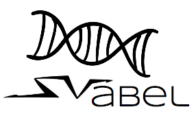

[](https://travis-ci.org/NCBI-Hackathons/SVabel)
[](https://img.shields.io/codecov/c/github/NCBI-Hackathons/SVabel?branch=master)

<p align="center">
 
</p>

This package contains helper functions to annotate structural variants (SV) and single nucleotide variants (SNV) from a VCF-format or BEDPE-format file.

## Installation
```
devtools::install_github('NCBI-Hackathons/SVabel')
```

<p align="center">
 
</p>

## Dependencies
* GenomicRanges
* rtracklayer

## Helper functions
* `fileValidator()`
 A function that checks the file format validity of the VCF, BEDPE and RNA-Seq quantification. The VCF file should follow the standard nomenclature of either VCF4.1 or VCF 4.2, the BEDPE file should be in a tab-delimited format per Lumpy’s output and the RNA-Seq quantification file in a tab delimited file containing two columns: Gene name, units of expression (in counts/TPM/FPKM/RPKM).
* `annotateVariants()`
 A function that finds the overlapping position between the variant and the reference gene annotation

* `compareRNASeq()`
 A function that merges the gene information obtained from annotateVariants() with the RNA-Seq quantification data from the user input

* `predictCausal()`
A function that filters for gene expression that are impacted as a result of the presence of the variants.

* `printOutput()`
A function that prints the output of the variant annotation in BEDPE or VCF format. Information for the ‘causal’ candidate variant will be added to the INFO column and name column of the VCF and BEDPE file respectively.

### Contributors
* Evan Biederstedt
* Peng Zhang
* Kundai Andrew Midzi
* Tze Yin Lim
* Naina Thangaraj
* Kelly Terlizzi

This project was initiated at an NCBI-style hackathon at the NYGC on August 2018.
